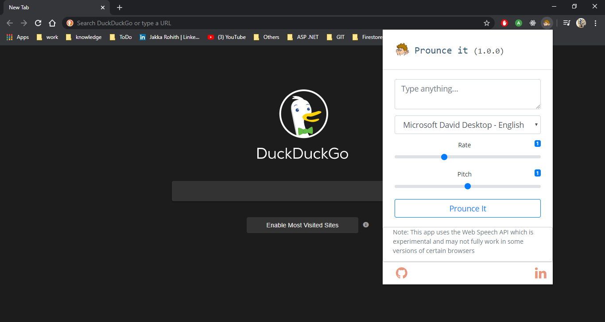
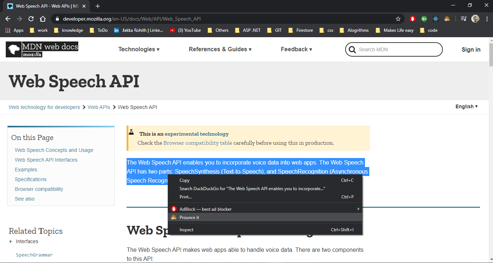

# Prounceit
This project is a web extension used to convert text to speech using web speech API .

There is feasibility to select language,pitch,rate included into prounceit provided by web speech API.

## Prounce it can also be access by context menu of the browser as soon the text is selected.

